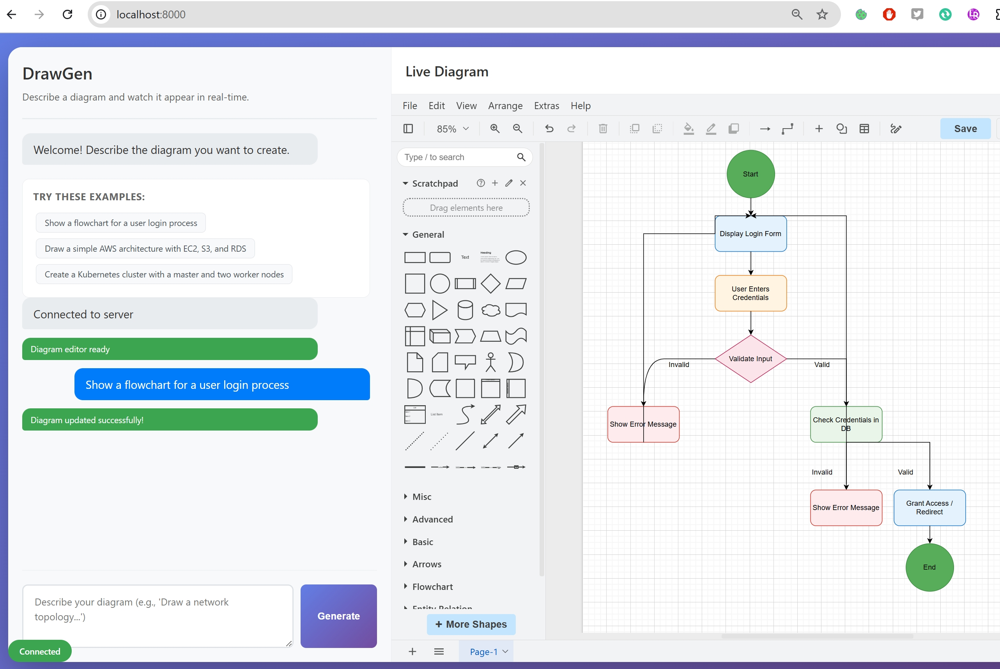

# DrawGen: AI-Powered Diagram Generator

 <!-- TODO: Replace with an actual screenshot or GIF of the app -->

**DrawGen** is a real-time, conversational diagramming tool. Describe your architecture, flowchart, or network topology in plain language, and watch it come to life instantly. It uses a powerful Large Language Model (LLM) backend to generate and modify [draw.io](https://draw.io) diagrams through a simple chat interface.


---

## ✨ Features

- **Conversational Interface:** Build and refine diagrams through a simple chat. No drag-and-drop required.
- **Real-Time Updates:** See your changes reflected instantly in the live draw.io editor.
- **Stateful Conversations:** The AI remembers the context of your diagram, allowing for complex, iterative modifications.
- **Advanced XML Processing:** Robust parsing with automatic correction of malformed XML, missing closing tags, and attribute value escaping.
- **Smart Error Recovery:** Graceful handling of AI response variations with automatic fallback to error diagrams when XML parsing fails.
- **Attribute Value Escaping:** Automatic escaping of HTML characters (`<`, `>`, `&`, quotes) inside XML attribute values for compliance with XML standards.
- **Error Logging:** Automatically captures both client-side and server-side errors into a `feedback.md` file for easy debugging.
- **Simple & Lightweight:** A single-page application with a clean Python/FastAPI backend. No database required.

---

## 🚀 How It Works

1.  **User Prompt:** The user enters a prompt in the chat interface (e.g., "Create a simple web server architecture").
2.  **WebSocket Communication:** The prompt is sent to the FastAPI backend via a WebSocket connection.
3.  **AI-Powered Generation:** The backend sends the entire conversation history to an LLM API (like DeepSeek), instructing it to return a `mxGraphModel` XML string.
4.  **Response Handling:**
    - **XML Responses:** If the AI returns valid XML, it's sent back to the client. The system includes advanced parsing with automatic correction of malformed XML, missing closing tags, and escaped attribute values.
    - **Text Responses:** If the AI returns a text message (e.g., clarifications or questions), it's sent as a chat message.
    - **Error Handling:** If XML parsing fails despite corrections, an error diagram is generated and displayed with diagnostic information.
5.  **Live Update:** The frontend receives the message and uses the `postMessage` API to load the XML into the embedded draw.io iframe, instantly updating the diagram.

---

## 🛠️ Technology Stack

- **Backend:** Python, FastAPI, Uvicorn
- **AI Integration:** `httpx` for asynchronous API calls
- **Real-time:** WebSockets
- **Frontend:** Vanilla HTML, CSS, and JavaScript
- **Diagramming:** draw.io (diagrams.net) Embedded API

---

## 📋 Requirements

- Python 3.9+
- An API Key from an LLM provider (e.g., DeepSeek, OpenAI) or a running local Ollama instance.

---

## ⚙️ Installation

1.  **Clone the repository:**
    ```bash
    git clone https://github.com/your-username/drawgen.git
    cd drawgen
    ```

2.  **Create and activate a virtual environment:**
    ```bash
    # Windows
    python -m venv venv
    .\venv\Scripts\Activate.ps1

    # macOS / Linux
    python3 -m venv venv
    source venv/bin/activate
    ```

3.  **Install the dependencies:**
    ```bash
    pip install -r requirements.txt
    ```

---

## ⚙️ Configuration

The application is configured via a `.env` file.

1.  **Create your `.env` file** by copying the example file:
    ```bash
    cp .env.example .env
    ```

2.  **Edit the `.env` file** to choose your provider and add the necessary credentials.

    -   **Set the Provider:** Choose between `deepseek`, `openai`, or `ollama`.
        ```ini
        LLM_PROVIDER=deepseek
        ```

    -   **Add Keys & Models:** Fill in the details for your chosen provider (e.g., `DEEPSEEK_API_KEY` for DeepSeek, `OLLAMA_MODEL` for Ollama, etc.). Refer to the comments in the `.env.example` file for guidance.

---

## ▶️ Running the Application

1.  **Start the server:**
    ```bash
    # Using the provided script (port 8050)
    python run_server.py
    
    # Or directly with uvicorn
    uvicorn app:app --reload --host 0.0.0.0 --port 8050
    ```

2.  **Open your browser:**
    Navigate to `http://localhost:8050`. You should see the DrawGen interface ready to go!

---

## 🤝 Contributing

Contributions, issues, and feature requests are welcome! Feel free to check the issues page.

---

## 👤 Author

- **Designed by Eiji**

---

## 🔧 Troubleshooting

### ImportError: cannot import name 'STATIC_URL'

This error usually occurs when:
1. **Virtual environment is not activated** - Make sure to activate the virtual environment:
   ```bash
   source venv/bin/activate  # Linux/macOS
   # or
   .\venv\Scripts\Activate.ps1  # Windows PowerShell
   ```

2. **Dependencies are not installed** - Install required packages:
   ```bash
   pip install -r requirements.txt
   ```

3. **Corrupted virtual environment** - Try recreating it:
   ```bash
   rm -rf venv
   python -m venv venv
   source venv/bin/activate  # or the Windows equivalent
   pip install -r requirements.txt
   ```

### Server not starting on port 8050

Check if port 8050 is already in use:
```bash
lsof -i:8050  # Linux/macOS
# or
netstat -ano | findstr :8050  # Windows
```

If the port is busy, you can:
1. Stop the existing process
2. Use a different port by modifying `run_server.py` and `app.py`

---
## 📄 License

This project is licensed under the MIT License. See the `LICENSE` file for details.




